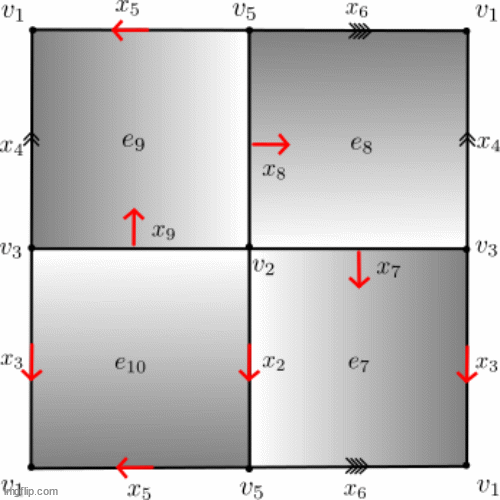

# Finite Topological Spaces
_Author: Ximena Fernandez_

**Finite_Spaces** is a SAGE module to work with Finite Topological Spaces.
We refer to [1] for the theoretical background and proofs of the correctness of the algorithms.

In [2], we developed a method to study Q**-transformations of group presentations based on finite spaces and a refinement of discrete Morse theory. It was applied to prove that potential counterexamples to the Andrews-Curtis conjecture do satisfy the conjecture. The computational experiments can be reproduced at **Potential_counterexamples_AC.ipynb**

Discrete Morse Theory for 3-deformations of 2-complexes in based in the notion of _internal collapse_ showed at the following animation. 

[1] Fernández, X. L. 
<a href='http://cms.dm.uba.ar/academico/carreras/doctorado/Tesis_Ximena_Fernandez.pdf'>_Combinatorial methods and algorithms in low dimensional topology and the Andrews-Curtis conjecture._</a> 
PhD thesis, Facultad de Ciencias Exactas y Naturales, Universidad de
Buenos Aires, 2017.

[2] Fernández, X. L.
<a href='https://arxiv.org/abs/1912.00115'> _3-deformations of 2-complexes and Morse Theory_</a>,  	arXiv:1912.00115, 2019.
